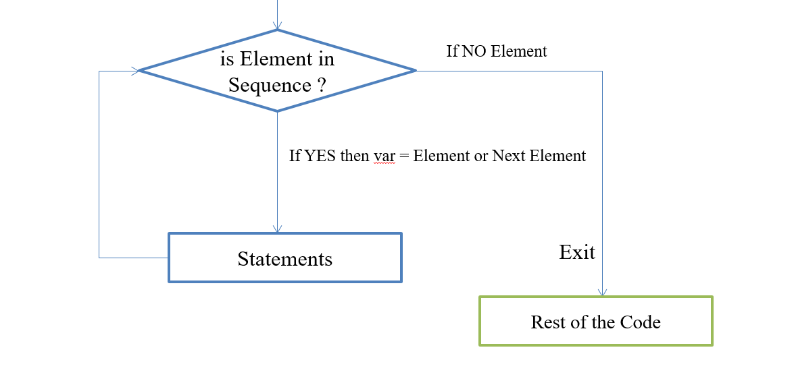

# Loops

- Loop control statements are used when a section of code may either be executed a fixed number of times, or while some condition is `true`.
- ### While
- ### For

---

# `while` Loop

- The while loop keeps repeating an action until an associated condition returns false.

- #### Syntax:
```python    
while(condition):
    Statement
Rest of the Code
```
> **Note:** Python Interpreter checks condition, If condition is `True`, then execute statements written after colon `(:)` 
- #### Example
```python
x = 0
while(x != 10):
    print(x, end=' ')
    x+=1
```
### Flowchart


## `while` Loop with `else`

- This repeatedly tests the condition and, if it is `True`, executes the Statement 1; if the condition is `False` (which may be the first time it is tested) the Statement 2 of the else clause, is executed and the loop terminates. 
- The `else` suite will always be executed when the `while` loop condition becomes `False` (unless exited by `break`).

- #### Syntax:
```python
while (condition):
    Statement 1
else:
    Statement 2
Rest of the Code
```
- #### Example:
```python
count = 1

while count <= 3:
    print("Count is:", count)
    count += 1
else:
    print("Loop finished successfully!")

print("Program continues...")
```
### Flowchart


## Infinite `while` Loop

- #### Syntax:
```python
while (True):
    Statement
Rest of the Code
#       or
while (True):
    Statement
    if(condition): 
        break
Rest of the Code
```
- #### Example:
```python
counter = 0

while True:
    print("This is an infinite loop. Counter:", counter)
    counter += 1

    if counter >= 5:
        print("Breaking the loop.")
        break

print("Loop has been terminated.")
```
## Nested `while` Loop
- #### Syntax:
```python
while(condition): 
    Statements
    while(condition):
        Statements
    Statements
Rest of Code
```
- #### Example
```python
i = 1

while i <= 3:
    print("Outer loop iteration:", i)
    j = 1
    while j <= 2:
        print("  Inner loop iteration:", j)
        j += 1
    i += 1

print("Nested loop complete.")
```

---

# `for` Loop

- The `for` loop is useful to iterate over the elements of sequence such as `string`, `list`, `tuple` etc. 
- #### Syntax:
```python
for var in sequence:
    Statements
Rest of the Code
```
- #### Example:
```python
name = "Musaraf"
for c in name:
    print(c)
print("Loop complete.")
```
### Flowchart:


## `for` Loop with `range()`
- #### Syntax
```python
for i in range(number):
    print(i)
Rest of the code
```
- #### Example
```python
for i in range(5):
    print(i)
print("Loop complete.")
```
Here is the updated example of **`for` Loop with `else`**, including a case with `break` where the `else` block is skipped:

## `for` Loop with `else`

* The `for` loop iterates over elements of a sequence like `string`, `list`, or `tuple`.

* The `else` block runs **only if the loop completes normally** (i.e., not terminated by `break`).

* #### Syntax:

```python
for var in sequence:
    Statements
else:
    Statements
Rest of the Code
```

* #### Example without `break`:

```python
fruits = ["apple", "banana", "cherry"]

for fruit in fruits:
    print("Fruit:", fruit)
else:
    print("All fruits have been printed.")

print("Loop and else block complete.")
```

* #### Example with `break` (else skipped):

```python
fruits = ["apple", "banana", "cherry"]

for fruit in fruits:
    if fruit == "banana":
        print("Banana found! Exiting loop.")
        break
    print("Fruit:", fruit)
else:
    print("All fruits have been printed.")

print("Loop terminated.")
```

## Nested `for` loop

* A `for` loop inside another `for` loop is known as a **nested `for` loop**.

* Useful for working with **matrices**, **grids**, **patterns**, etc.

* #### Syntax

```python
for i in range(n):
    for j in range(y):
        Statements
    Statements
Rest of the Code
```

* #### Example

```python
for i in range(1, 4):  # Outer loop
    print("Outer loop iteration:", i)
    for j in range(1, 3):  # Inner loop
        print("  Inner loop iteration:", j)
print("Nested loop execution complete.")
```

---