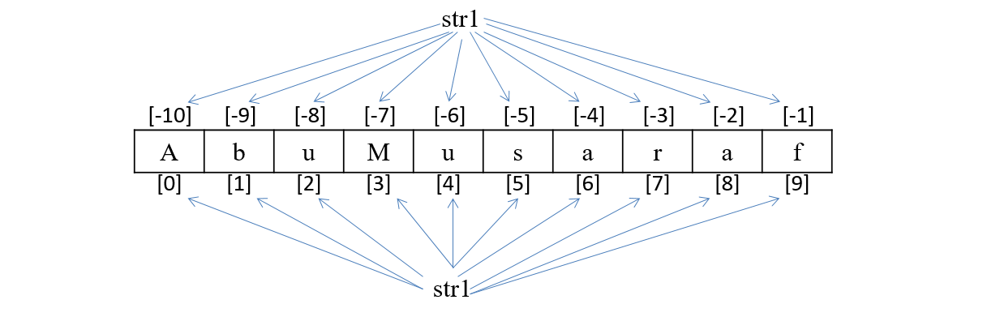

# String

- String represents group of characters. Strings are enclosed in double quotes or single quotes. The `str` data type represents a String.
- #### Example:- 
    `"Hello", "Musaraf", 'India'`
    `str1 = "Bharat"`

# Creating String
### Single Quotes
```python
str1 = 'Musaraf Hossain'
```
### Double quotes
```python
str2 = "Musaraf Hossain"
```
### Triple Single Quotes 
This is useful to create strings which span into several lines. 
```python
str3 = '''Hello Guys
          My name is
          Musaraf Hossain'''
```
### Triple Double Quotes 
This is useful to create strings which span into several lines. 
```python
str4 = """Hello Guys
          My name is
          Musaraf Hossain"""
```
### Double Quote inside Single Quotes
```python
str5 = 'Hello "Musaraf" How are you'
```
### Single Quote inside Double quotes
```python
str6 = "Hello 'Musaraf' How are you"
```
### Using Escape Characters
```python
str7 = “Hello \nHow are You ?”
```
### Raw String 
Row string is used to nullify the effect of escape characters.
```python
str8 = r"Hello \nHow are You ?"
print(str8)         # Output: Hello \nHow are You ?
```
# Index

- Index represents the position number of characters in a string.
- #### Example:- 
```python
str1 = "AbuMusaraf"
```


# String Length

- Length of string represents the number of characters in a string.
- `len()` Function is used to get length of string.
- #### Example:- 
```python
str1 = Musaraf
n = len(str1)       # Output: 7
```

# Accessing String
## Using Index
```python
str1 = "Musaraf"
print(str1)         # Musaraf
print(str1[0])      # M
print(str1[1])      # u
print(str1[2])      # s
print(str1[3])      # a
print(str1[-1])     # f
```
## Using loop
```python
str1 = "Musaraf"
for c in str1:
    print(c)

for i range(len(str1)):
    print(str1[i])

i = 0
while i < len(str1) :
    print(str1[i])
    i+=1
```

# Mutable and Immutable Object
## Mutable Object 
- Mutable objects are those object whose value or content can be changed as and when required.
- #### Example:- 
    `List`, `Set`, `Dictionaries` 

## Immutable Object 
- Immutable objects are those object whose value or content can not be changed.
- #### Example:- 
    `Numbers`, `String`, `Tuple`

# Immutable String

In Python, Strings are immutable object which means it’s value or content can not be changed.
```python
str1 ="Musaraf"
str1[4] ="i" # TypeError: 'str' object does not support item assignment
```
# Slicing Operator

- Slicing on String can be used to retrieve a piece of the string. Slicing is useful to retrieve a range of elements. 
- #### Syntax:-
```python 
new_string_name = string_name[start:stop:stepsize]
```
- `start` – It represents starting point. By default its 0
- `stop` – It represents ending point.
- `stepsize` – It represents step interval. By default It is 1
- If start and stop are not specified then slicing is done from `0th` to `n-1th`  elements.
- Start and Stop can be negative number.
- #### Example:-
```python
str1 = "Musaraf"
print(str1[0:6:2])      # Msr
```

# Repetition Operator

- Repetition operator is used to repeat the string for several times. It is denoted by `*`.
- #### Example:-
```python 
x = "$" * 7
print(x)            # $$$$$$$
str1 = "Musaraf"
print(str1 * 5)     # MusarafMusarafMusarafMusarafMusaraf
```

# Concatenation Operator

- Concatenation operator is used to join two string. It is denoted by `+`.
- #### Example:-
```python
str1 = "Musaraf"
str2 = "Hossain"
str3 = str1 + str2
print(str3)         # MusarafHossain
```

# Comparing String

| Operator | Meaning |
|----------|---------|
| `<` | Less than |
| `>` | Greater than |
| `<=` | Less than equal to |
| `>=` | Greater than equal to |
| `==` | Equal to |
| `!=` | Not equal to |

#### Example:-
```python
str1 = "apple"
str2 = "banana"

print("str1 < str2:", str1 < str2)     # True, because 'a' comes before 'b'
print("str1 > str2:", str1 > str2)     # False
print("str1 <= str2:", str1 <= str2)   # True
print("str1 >= str2:", str1 >= str2)   # False
print("str1 == str2:", str1 == str2)   # False
print("str1 != str2:", str1 != str2)   # True
```

# Formatting String

## C-Style String Formatting

### `% operator`/ `Modulo Operator`/ `Interpolation Operator` 
- This operator is used for formatting strings. It interprets the left argument much like a `sprintf()` style format string to be applied to the right argument, and returns the string resulting from this formatting operation.
- #### Syntax:-
```python 
print("Format placeholder" %(data))
```
- **Format placeholder -** `%[flags][width][.precision]type`
- **`%` -** marks the start of the specifier
- **Flags -** It affect the result of some conversion type. like `"%+d"`, `+` is the flag.
- **Width -** Minimum field width. like `"%8d"` 
- **Precision -** Given as `.` Followed by the precision. like `"%.2f"`
- **Type -** Conversion type. like `d`, `f`
- **data -** It can be literal, variable, expression etc.

- #### Example:-
```python
print("My name is %s and My age is %d" %("Musaraf Hossain", 19))
```
> **Note:** Maintain Order in above statement first string then integer

- #### Syntax:-
```python 
print("Format placeholder" %{'key':value})
```
- **Format placeholder -** `%(mapping_key)[flags][width][.precision]type`
- **`%` -** marks the start of the specifier
- **Mapping_key -** Consisting of parenthesized sequence of characters. like `key`
- **Flags -** It affect the result of some conversion type. like `"%+d"`, `+` is the flag.
- **Width -** Minimum field width. like `"%8d"` 
- **Precision -** Given as `.` Followed by the precision. like `"%.2f"`
- **Type -** Conversion type. like `d`, `f`

#### Example:-
```python
print("My name is %(nm)s and My age is %(ag)d" %{'ag':19, 'nm':"Musaraf Hossain"})
```
> **Note:** Do not need to maintain Order in above statement.

### Conversion Types
|Conversion Type|Meaning|
|---------------|-------|
**d**|**Signed integer decimal.**
I|Signed integer Decimal
o|Signed octal value.
x|Signed hexadecimal (lowercase).
X|Signed hexadecimal (uppercase).
e|Floating point exponential format (lowercase).
E|Floating point exponential format (uppercase).
**f**|**Floating point decimal format.**
F|Floating point decimal format.
g|Floating Point format. Uses lower case exponential format if exponent is less than -4 or not less than recision, decimal format otherwise
G|Floating Point format. Uses lower case exponential format if exponent is less than -4 or not less than recision, decimal format otherwise
c|Single character (accepts integer or single character string)
r|String (converts any python object using repr())
**s**|**String (converts any Python object using str()).**
A|String (Converts any python object using ascii())
%|No argument is converted, result in a % character in the result

### Flags
|Flags|Meaning|
|---------------|-------|
#|Used with o, x or X specifiers the value is preceded with 0, 0o, 0O, Ox or OX respectively.
0|The conversion will be zero padded for numeric values.
-|The converted value is left adjusted (overrides the '0' conversion if both are given).
` `|(a space) A blank should be left before a positive number (or empty string) produced by a signed conversion.
+|A sign character ('+' or '-') will precede the conversion (overrides a "space" flag).

### Examples:-
```python
print("%d" % 432)                                   #432
print("% d" % 432)					                #432
print("%+d" % 432)					                #+432
print("%8d" % 432)					                #        432
print("%08d" % 432)				               #00000432
print("%d %d" % (432, 345))				            #432 345
print("%f" % 432.123)				                #432.123000
print("%f" % 432.123456)				            #432.123456
print("%f" % 432.12345651)				            #432.123457
print("%f" % 432.12345641)				            #432.123456
print("%.3f" % 432.123)                             #432.123
print("%.2f" % 432.123)                             #432.12
print("%9.2f" % 432.128)                            #   432.12
print("%09.2f" % 432.123)                           #000432.12	
print("%9.2f" %4388453232.124)                      #4388453232.12
print("%s" % "Musaraf")				                #Musaraf
print("%s %s" % ("Hello", "Musaraf"))		        #Hello Musaraf
print("%d %s" % (432, "Musaraf"))			        #432 GeekyShows
print("%s %d" % (432, "Musaraf")) 		            #TypeError
print("%(nm)s  %(ag)d" % {'ag':20, 'nm':"Musaraf"}) #Musaraf 20
```

## `format()` Method

- This method is used to format strings. The string on which this method is called can contain literal text or replacement fields delimited by braces `{}`. Each replacement field contains either the numeric index of a positional argument, or the name of a keyword argument. It returns a copy of the string where each replacement field is replaced with the string value of the corresponding argument.
- #### Syntax:-
```python 
str.format(arg)
```
- #### Example:- 
```python
str = "My age is {}"
print(str.format(62))
print("My age is {}".format(62))
```
